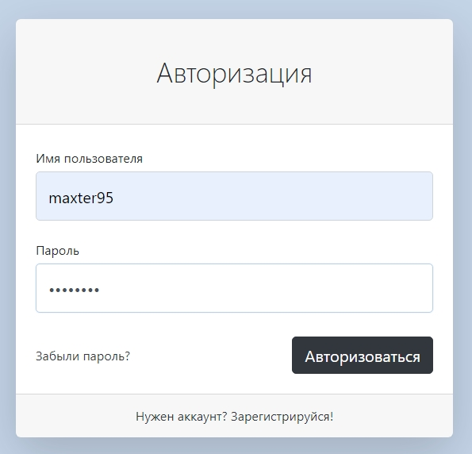
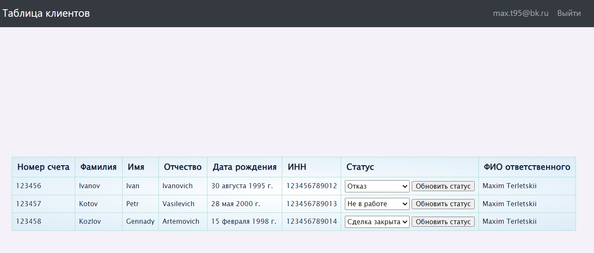

# Алгоритм запуска проекта

1. Клонируем репозиторий:
```bash
git clone https://github.com/maxter9595/aton-task.git
```

2. Открываем папку aton-task

3. Проводим запуск виртуального окружения Python
```bash
python -m venv venv
```

4. Проводим подключение к venv в IDE, активируем venv
```bash
venv\Scripts\activate
```

5. Устанавливаем библиотеки
```bash
pip install -r requirements.txt
```

6. Проводим миграцию к локальной БД (**файл db.sqllite не выбрасываем!**)
```bash
python manage.py makemigrations
python manage.py migrate   
```

7. Запускаем сервер
```bash
python manage.py runserver
```

8. Вводим логин и пароль

    **Логин:** maxter95. **Пароль:** pass4321





